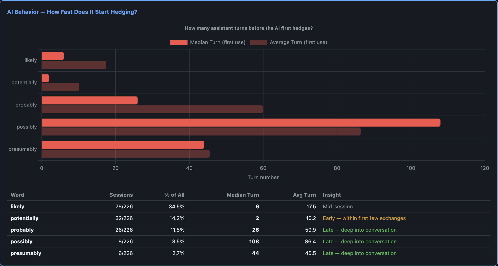

# likely

A Claude Code hook that catches AI hedging, making ungrounded assumptions, and forces verification as a way for self-healing.

## The Problem

LLMs hedge constantly. Words like "likely", "potentially", "probably" appear in **35% of sessions** — not because the model is uncertain, but because it's trained to sound non-committal. This is dangerous in a coding context: when the AI says "this will likely work," it might be guessing rather than verifying.

After analyzing 14,000+ messages across Claude Code, Codex, and Cortex sessions:



| Word | % Sessions | Median Turn (first use) | Avg Turn |
|------|-----------|------------------------|----------|
| likely | 34.5% | **6** | 17.5 |
| potentially | 14.2% | **2** | 10.2 |
| probably | 11.5% | 26 | 59.9 |
| possibly | 3.5% | 108 | 86.4 |
| presumably | 2.7% | 44 | 45.5 |

The AI uses "potentially" by **turn 2** (median). "Likely" shows up by **turn 6**. These aren't genuine expressions of uncertainty — they're verbal tics that mask whether the AI actually verified its claims.

## The Solution

Two Claude Code hooks forming a feedback loop:

1. **`hedge-detector.js`** (Stop hook) — After each AI response, scans for hedging words. If found, writes a session-scoped signal file.

2. **`hedge-enforcer.js`** (UserPromptSubmit hook) — Before the next turn is processed, reads the signal and injects corrective context forcing the AI to **verify its assumptions using tools** (read files, grep, run tests) before responding.

```
AI responds: "this will likely work"
         │
         ▼
    Stop hook detects "likely"
    Writes signal file
         │
         ▼ (next user message)
    UserPromptSubmit hook reads signal
    Injects: "VERIFY your claims before answering"
         │
         ▼
    AI now reads files, checks code, states evidence
```

The AI doesn't just rephrase with more confidence — it's forced to **do the research** and cite what it found.

## Installation

**macOS / Linux:**
```bash
curl -fsSL https://raw.githubusercontent.com/terpjwu1/likely/main/install.sh | bash
```

**Windows (PowerShell):**
```powershell
irm https://raw.githubusercontent.com/terpjwu1/likely/main/install.ps1 | iex
```

Restart Claude Code after installing.

**To uninstall:**
```bash
cp ~/.claude/settings.json.bak-likely ~/.claude/settings.json
rm ~/.claude/hooks/hedge-detector.js ~/.claude/hooks/hedge-enforcer.js
```

### Manual Installation

If you prefer to configure manually, add these to your `~/.claude/settings.json` hooks section:

```json
{
  "hooks": {
    "Stop": [
      {
        "hooks": [
          {
            "type": "command",
            "command": "node ~/.claude/hooks/hedge-detector.js",
            "timeout": 5,
            "async": true
          }
        ]
      }
    ],
    "UserPromptSubmit": [
      {
        "hooks": [
          {
            "type": "command",
            "command": "node ~/.claude/hooks/hedge-enforcer.js",
            "timeout": 5
          }
        ]
      }
    ]
  }
}
```

**Important:** The enforcer must NOT have `"async": true` — its stdout needs to be captured by Claude Code for context injection.

## How It Works

### Detection (Stop Hook)

The detector receives `last_assistant_message` from Claude Code after each response. It regex-matches against:

```
likely, potentially, probably, possibly, presumably,
may be, might be, could be, seems to, appears to
```

If matches are found, it writes a session-scoped signal file:
- Path: `~/.claude/hooks/signals/hedge-{sessionId}.json`
- Atomic write (tmp file + rename) for race safety
- Severity: `high` (3+ matches) or `medium` (1-2)

### Enforcement (UserPromptSubmit Hook)

On the next user message, the enforcer:
1. Reads the signal file for this session
2. Checks TTL (5 min expiry for stale signals)
3. If valid, outputs JSON to stdout with `additionalContext`
4. Claude Code injects this as a system reminder the AI must follow
5. Deletes the signal (consumed)

### Severity Levels

**High (3+ hedging words):**
> CRITICAL: You are operating on ASSUMPTIONS. For EACH hedged claim, use your tools to VERIFY it right now — read the file, grep for the function, run a test. State what you found.

**Medium (1-2 hedging words):**
> Note: Quickly verify assumptions you made. If you said something "likely" works, confirm it actually does.

## Design Decisions

- **Session-scoped signals** — keyed by `session_id`, not global. Multiple concurrent sessions don't interfere.
- **Atomic writes** — temp file + rename prevents partial reads.
- **5-minute TTL** — stale signals from crashed sessions auto-expire.
- **No stemming** — regex uses exact word boundaries, not NLP. Fast and predictable.
- **Feedback loop, not blocking** — hooks can't re-generate responses. Instead, the correction shapes the *next* turn. The AI learns within the session.
- **Zero dependencies** — plain Node.js, no npm packages. Just `fs`, `path`, `os`.

## Relation to Buddy Guard Mode

This project is a companion to [Buddy](https://github.com/fiorastudio/buddy) — an MCP coding companion that tracks reasoning quality via guard mode. Buddy's guard mode extracts claims from conversations and scores them by epistemic basis (empirical, deduction, research, assumption, vibes). The `likely` hooks address a complementary problem:

- **Buddy guard mode** observes reasoning *structure* — are claims well-sourced? Do they support or contradict each other?
- **likely** observes reasoning *confidence* — is the AI hedging when it should be verifying?

Together they form a two-layer quality system: Buddy watches the *what* (claim graph integrity), `likely` watches the *how* (are claims backed by evidence or just hedged guesses).

The hedging analysis data that motivated this project (35% session penetration, median turn 1 for "potentially") was collected using the same DuckDB analytics pipeline that powers Buddy's reasoning insights.

## Limitations

- Corrective context arrives on the **next turn**, not the current one. The hedged response is already shown.
- Hooks cannot force extended thinking or change effort level dynamically.
- The AI may still hedge if the corrective prompt competes with other strong context.
- Words like "might" and "could" (without "be") aren't tracked to avoid excessive false positives.

## Testing

```bash
# Test detector
echo '{"session_id":"test","last_assistant_message":"this will likely work and potentially fix it"}' | node hedge-detector.js
cat ~/.claude/hooks/signals/hedge-test.json

# Test enforcer
echo '{"session_id":"test"}' | node hedge-enforcer.js
# Should output JSON with additionalContext
```

## Evaluation Results (2026-06-09)

LLM-reviewed analysis of all hook fires across Claude Code sessions (sessionSearch + giffrey projects), Codex, and Cortex. Each exchange was reviewed in full context: what the AI said before the hook fired, the hook injection, and the AI's response after.

### Summary

| Metric | Value |
|---|---|
| Total hook fires analyzed | 11 |
| False positive rate | 55% (6/11) |
| Effectiveness rate | 45% (5/11) |
| Value added when correctly fired | **100% (5/5)** |

When the hook correctly identifies lazy speculation, the AI verifies every single time. The false positive rate is noisy but tolerable — the cost is just a slightly longer response where the AI double-checks something that was already fine.

### Per-Fire Analysis

| # | Project | Detected Word | FP? | Value? | What Happened |
|---|---|---|---|---|---|
| 1 | giffrey | "likely" | Yes | No | Appropriate uncertainty about config variants |
| 2 | giffrey | "likely, might be" | **No** | **Yes** | Speculation → concrete diagnostic table with verified data |
| 3 | giffrey | "likely, could be" | **No** | **Yes** | Guesses → inspected git log, traced to specific commit |
| 4 | giffrey | "probably, might be" | **No** | **Yes** | Speculation → verified actual file duration, found real bug |
| 5 | sessionSearch | "likely" | Yes | No | Triggered on "likely" in a GitHub repo name |
| 6 | sessionSearch | "likely" | Yes | No | Same — repo name false positive |
| 7 | sessionSearch | "likely" | Yes | No | Word not in AI's response — context bleed |
| 8 | sessionSearch | "likely" | **No** | **Yes** | "likely expired" → moved to actionable code fix |
| 9 | sessionSearch | "could be" | Yes | No | Used illustratively in an example |
| 10 | sessionSearch | "could be" | **No** | **Yes** | Ambiguity acknowledged → inspected prompt, found bugs |
| 11 | sessionSearch | "likely" | Yes | No | Fired on context outside AI's response |

### False Positive Patterns

| Pattern | Count | Example |
|---|---|---|
| Word in proper noun/URL | 2 | "likely" as a GitHub repo name |
| Appropriate epistemic hedging | 2 | Genuine uncertainty ("I don't know which config variant") |
| Context bleed | 2 | Word in quoted text or surrounding session context |

### True Positive Behavior Changes

All 5 true positive cases follow the same pattern:

1. **Before**: AI makes speculative technical claim without evidence
2. **Hook fires**: "Verify your assumptions before responding"
3. **After**: AI investigates — reads files, checks git history, runs commands, produces evidence

Examples:
- Speculation about quality loss → concrete diagnostic table with verified resolution data
- Unverified guesses about audio muffling → inspected git log, traced to specific prior commit
- "Probably a timing issue" → measured actual file duration (5:45), found real bug in trim logic

### Methodology

- Extracted full conversation context (before/after) from raw JSONL session transcripts
- Sent 11 exchanges to Claude Sonnet 4.6 for blind evaluation
- Each exchange judged on: was the hedge appropriate? did behavior change? did the hook add value?
- Analysis covers sessions from 2026-06-03 (install date) through 2026-06-09

## License

MIT
