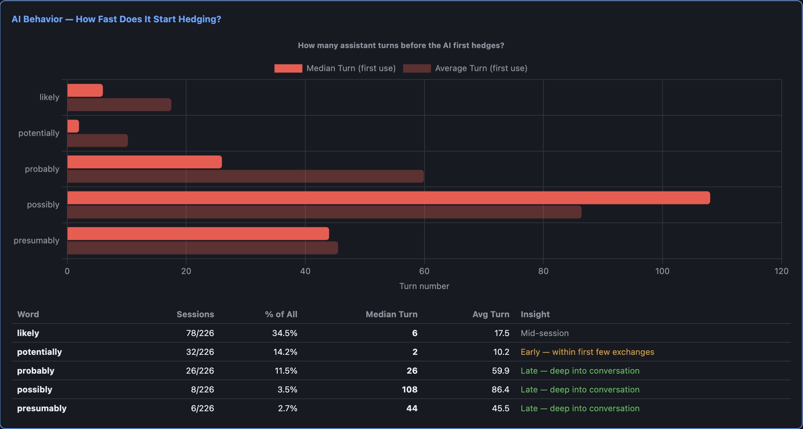

# likely

A Claude Code hook that catches AI hedging, making ungrounded assumptions, and forces verification as a way for self-healing.

## The Problem

LLMs hedge constantly. Words like "likely", "potentially", "probably" appear in **35% of sessions** — not because the model is uncertain, but because it's trained to sound non-committal. This is dangerous in a coding context: when the AI says "this will likely work," it might be guessing rather than verifying.

After analyzing 14,000+ messages across Claude Code, Codex, and Cortex sessions:



| Word | % Sessions | Median Turn (first use) | Avg Turn |
|------|-----------|------------------------|----------|
| likely | 34.5% | **6** | 17.5 |
| potentially | 14.2% | **2** | 10.2 |
| probably | 11.5% | 26 | 59.9 |
| possibly | 3.5% | 108 | 86.4 |
| presumably | 2.7% | 44 | 45.5 |

The AI uses "potentially" by **turn 2** (median). "Likely" shows up by **turn 6**. These aren't genuine expressions of uncertainty — they're verbal tics that mask whether the AI actually verified its claims.

## The Solution

Two Claude Code hooks forming a feedback loop:

1. **`hedge-detector.js`** (Stop hook) — After each AI response, scans for hedging words. If found, writes a session-scoped signal file.

2. **`hedge-enforcer.js`** (UserPromptSubmit hook) — Before the next turn is processed, reads the signal and injects corrective context forcing the AI to **verify its assumptions using tools** (read files, grep, run tests) before responding.

```
AI responds: "this will likely work"
         │
         ▼
    Stop hook detects "likely"
    Writes signal file
         │
         ▼ (next user message)
    UserPromptSubmit hook reads signal
    Injects: "VERIFY your claims before answering"
         │
         ▼
    AI now reads files, checks code, states evidence
```

The AI doesn't just rephrase with more confidence — it's forced to **do the research** and cite what it found.

## Two-Layer Defense

The install sets up two complementary layers:

| Layer | Mechanism | When it acts | Effect |
|---|---|---|---|
| **CLAUDE.md rule** | Persistent instruction in `~/.claude/CLAUDE.md` | Read at session start | Prevents hedging proactively — AI knows from the start to verify instead of guess |
| **Hooks** | Ephemeral per-turn injection | After hedging is detected | Catches violations that slip through and forces immediate verification |

In community testing, users report the CLAUDE.md rule alone reduces hedging noticeably — the AI reads it at session start and adjusts its default behavior. The hooks act as enforcement for cases where the AI still defaults to hedging under pressure (long contexts, complex debugging, uncertain system state).

The rule installed (wrapped in markers for clean uninstall):

```markdown
<!-- likely:start -->
## Ambiguity, Uncertainty, & lack of Clarity

NEVER make assumptions or guesses when information is unclear, uncertain, or ambiguous.
First, leverage tools, skills, and/or plugins to collect information and evidence, or
if needed, deploy a team of research agents. You may always ask the user to help clarify
information, it's better to ask the user instead of assuming or guessing, as assumptions
or guesses can waste considerable time and effort.
<!-- likely:end -->
```

## Installation

**macOS / Linux:**
```bash
curl -fsSL https://raw.githubusercontent.com/terpjwu1/likely/main/install.sh | bash
```

**Windows (PowerShell):**
```powershell
irm https://raw.githubusercontent.com/terpjwu1/likely/main/install.ps1 | iex
```

Restart Claude Code after installing.

**To uninstall:**
```bash
cp ~/.claude/settings.json.bak-likely ~/.claude/settings.json
rm ~/.claude/hooks/hedge-detector.js ~/.claude/hooks/hedge-enforcer.js
sed -i '' '/<!-- likely:start -->/,/<!-- likely:end -->/d' ~/.claude/CLAUDE.md
```

### Manual Installation

If you prefer to configure manually, add these to your `~/.claude/settings.json` hooks section:

```json
{
  "hooks": {
    "Stop": [
      {
        "hooks": [
          {
            "type": "command",
            "command": "node ~/.claude/hooks/hedge-detector.js",
            "timeout": 5,
            "async": true
          }
        ]
      }
    ],
    "UserPromptSubmit": [
      {
        "hooks": [
          {
            "type": "command",
            "command": "node ~/.claude/hooks/hedge-enforcer.js",
            "timeout": 5
          }
        ]
      }
    ]
  }
}
```

**Important:** The enforcer must NOT have `"async": true` — its stdout needs to be captured by Claude Code for context injection.

## How It Works

### Detection (Stop Hook)

The detector receives `last_assistant_message` from Claude Code after each response. It regex-matches against:

```
likely, potentially, probably, possibly, presumably,
may be, might be, could be, seems to, appears to
```

If matches are found, it writes a session-scoped signal file:
- Path: `~/.claude/hooks/signals/hedge-{sessionId}.json`
- Atomic write (tmp file + rename) for race safety
- Severity: `high` (3+ matches) or `medium` (1-2)

### Enforcement (UserPromptSubmit Hook)

On the next user message, the enforcer:
1. Reads the signal file for this session
2. Checks TTL (5 min expiry for stale signals)
3. If valid, outputs JSON to stdout with `additionalContext`
4. Claude Code injects this as a system reminder the AI must follow
5. Deletes the signal (consumed)

### Severity Levels

**High (3+ hedging words):**
> CRITICAL: You are operating on ASSUMPTIONS. For EACH hedged claim, use your tools to VERIFY it right now — read the file, grep for the function, run a test. State what you found.

**Medium (1-2 hedging words):**
> Note: Quickly verify assumptions you made. If you said something "likely" works, confirm it actually does.

## Design Decisions

- **Session-scoped signals** — keyed by `session_id`, not global. Multiple concurrent sessions don't interfere.
- **Atomic writes** — temp file + rename prevents partial reads.
- **5-minute TTL** — stale signals from crashed sessions auto-expire.
- **No stemming** — regex uses exact word boundaries, not NLP. Fast and predictable.
- **Feedback loop, not blocking** — hooks can't re-generate responses. Instead, the correction shapes the *next* turn. The AI learns within the session.
- **Zero dependencies** — plain Node.js, no npm packages. Just `fs`, `path`, `os`.

## Relation to Buddy Guard Mode

This project is a companion to [Buddy](https://github.com/fiorastudio/buddy) — an MCP coding companion that tracks reasoning quality via guard mode. Buddy's guard mode extracts claims from conversations and scores them by epistemic basis (empirical, deduction, research, assumption, vibes). The `likely` hooks address a complementary problem:

- **Buddy guard mode** observes reasoning *structure* — are claims well-sourced? Do they support or contradict each other?
- **likely** observes reasoning *confidence* — is the AI hedging when it should be verifying?

Together they form a two-layer quality system: Buddy watches the *what* (claim graph integrity), `likely` watches the *how* (are claims backed by evidence or just hedged guesses).

The hedging analysis data that motivated this project (35% session penetration, median turn 1 for "potentially") was collected using the same DuckDB analytics pipeline that powers Buddy's reasoning insights.

## Limitations

- Corrective context arrives on the **next turn**, not the current one. The hedged response is already shown.
- Hooks cannot force extended thinking or change effort level dynamically.
- The AI may still hedge if the corrective prompt competes with other strong context.
- Words like "might" and "could" (without "be") aren't tracked to avoid excessive false positives.

## Testing

```bash
# Test detector
echo '{"session_id":"test","last_assistant_message":"this will likely work and potentially fix it"}' | node hedge-detector.js
cat ~/.claude/hooks/signals/hedge-test.json

# Test enforcer
echo '{"session_id":"test"}' | node hedge-enforcer.js
# Should output JSON with additionalContext
```

## Evaluation Results

LLM-reviewed analysis of hook fires across Claude Code sessions. Each exchange reviewed in full context: AI response before hook → hook injection → AI response after.

### Latest Eval: Week of 2026-06-20 (18 fires)

| Metric | Value | vs Prior |
|---|---|---|
| Total hook fires analyzed | 18 | +7 |
| False positive rate | 44% (8/18) | improved from 55% |
| Effectiveness rate | 44% (8/18) | stable |
| Value added on true positives | **73% (8/10)** | down from 100% |
| Total fires all time | 44 | — |
| Projects covered | 4 (onDeviceIntentEngine, algolia, sessionSearch, giffrey) | +2 new |

#### Per-Fire Analysis

| # | Project | Word | FP? | Value? | What Happened |
|---|---|---|---|---|---|
| 1 | onDeviceIntentEngine | "could be" | Yes | No | Misfired on incomplete display context |
| 2 | onDeviceIntentEngine | "might be" | **No** | **Yes** | Cold-start speculation → committed to verifying Nano capabilities |
| 3 | onDeviceIntentEngine | "might be" | Yes | No | Appropriate hedge about browser caching |
| 4 | onDeviceIntentEngine | "probably" | **No** | **Yes** | Speculation about assembly pipeline → verified actual code path |
| 5 | onDeviceIntentEngine | "might be" | **No** | No | Genuine uncertainty, hook fired correctly but AI ignored it |
| 6 | onDeviceIntentEngine | "likely" | Yes | No | Appropriate epistemic humility about a diagnosable bug |
| 7 | onDeviceIntentEngine | "might be" | Yes | No | Appropriately cautious about iframe errors |
| 8 | onDeviceIntentEngine | "likely" | **No** | **Yes** | Lazy "likely a Bedrock key" → investigated, found correct Portkey config |
| 9 | onDeviceIntentEngine | "likely" | Yes | No | Well-founded claim about LLM behavior, not speculation |
| 10 | onDeviceIntentEngine | "likely" | **No** | **Yes** | Speculated about beforeunload → verified actual localStorage save logic |
| 11 | onDeviceIntentEngine | "could be" | Yes | No | False trigger on UI state description |
| 12 | onDeviceIntentEngine | "could be, likely" | Yes | No | Appropriate hedges in privacy/legal analysis |
| 13 | onDeviceIntentEngine | "likely, probably" | **No** | **Yes** | Attributed p95 latency to context injection → found retries as true cause |
| 14 | algolia | "could be" | Yes | No | Hook fired on diagram color critique |
| 15 | algolia | "might be" | **No** | **Yes** | Flagged assumptions → data investigation corrected V-code relationship model |
| 16 | algolia | "likely" | **No** | **Yes** | Speculated about leftover DOM → found showResponse/grid container bug |
| 17 | algolia | "might be" | **No** | **Yes** | Hypothesized URL fabrication → index inspection confirmed stale URLs + missing field |
| 18 | sessionSearch | "likely" | Yes | No | Factual recap referencing prior eval, not speculation |

#### New Insight: Hook-Fired-But-Ignored

Two exchanges (#5, #12) show a new failure mode: the hook fired correctly on genuine hedges, but the AI **completely ignored** the verification instruction and moved on. Prior eval showed 100% compliance; this week shows ~73%. The hook's influence is not absolute.

### Prior Eval: 2026-06-09 (11 fires)

| Metric | Value |
|---|---|
| Total hook fires analyzed | 11 |
| False positive rate | 55% (6/11) |
| Effectiveness rate | 45% (5/11) |
| Value added when correctly fired | **100% (5/5)** |

<details>
<summary>Per-fire details (click to expand)</summary>

| # | Project | Detected Word | FP? | Value? | What Happened |
|---|---|---|---|---|---|
| 1 | giffrey | "likely" | Yes | No | Appropriate uncertainty about config variants |
| 2 | giffrey | "likely, might be" | **No** | **Yes** | Speculation → concrete diagnostic table with verified data |
| 3 | giffrey | "likely, could be" | **No** | **Yes** | Guesses → inspected git log, traced to specific commit |
| 4 | giffrey | "probably, might be" | **No** | **Yes** | Speculation → verified actual file duration, found real bug |
| 5 | sessionSearch | "likely" | Yes | No | Triggered on "likely" in a GitHub repo name |
| 6 | sessionSearch | "likely" | Yes | No | Same — repo name false positive |
| 7 | sessionSearch | "likely" | Yes | No | Word not in AI's response — context bleed |
| 8 | sessionSearch | "likely" | **No** | **Yes** | "likely expired" → moved to actionable code fix |
| 9 | sessionSearch | "could be" | Yes | No | Used illustratively in an example |
| 10 | sessionSearch | "could be" | **No** | **Yes** | Ambiguity acknowledged → inspected prompt, found bugs |
| 11 | sessionSearch | "likely" | Yes | No | Fired on context outside AI's response |

</details>

### Cumulative False Positive Patterns

| Pattern | Count | Example | Fix |
|---|---|---|---|
| Appropriate epistemic hedging | 5 | Genuine uncertainty in legal/privacy/caching contexts | Exempt domains where hedging is structurally correct |
| Context bleed / invisible word | 4 | Word in quoted text, diagram, or surrounding context | Scope detection to AI's own prose only |
| Word in proper noun/URL | 2 | "likely" as a GitHub repo name | Require hedge word in grammatical clause, not adjacent to URL/slash |
| Factual recap | 1 | Referencing a prior eval result | Exclude session-summary/recap messages |
| Illustrative example | 1 | "this could be either X or Y" in a definition | Don't fire when word is inside quotation marks |

### True Positive Behavior Pattern

When the hook fires correctly on lazy speculation, the AI consistently:
1. Stops speculating
2. Uses tools to verify (reads files, checks git history, inspects data, runs commands)
3. Cites concrete evidence in the response

Examples across projects:
- **giffrey**: "Probably a timing issue" → measured actual file duration (5:45), found real bug in trim logic
- **onDeviceIntentEngine**: "Likely a Bedrock key" → investigated env vars, found correct Portkey gateway
- **algolia**: "Might be fabricated URLs" → index inspection confirmed stale URL pattern + missing product_code field
- **onDeviceIntentEngine**: Attributed p95 latency to context injection → root-cause analysis found followup retries as true cause

### Methodology

- Full conversation context extracted from raw JSONL session transcripts (Claude Code `attachment` entries with `hook_additional_context` type)
- Exchanges sent to Claude Sonnet 4.6 for blind evaluation
- Each judged on: was the hedge appropriate? did behavior change? did the hook add value?
- Covers 4 projects, 8 sessions, 44 total fires from 2026-06-03 through 2026-06-27

## License

MIT
